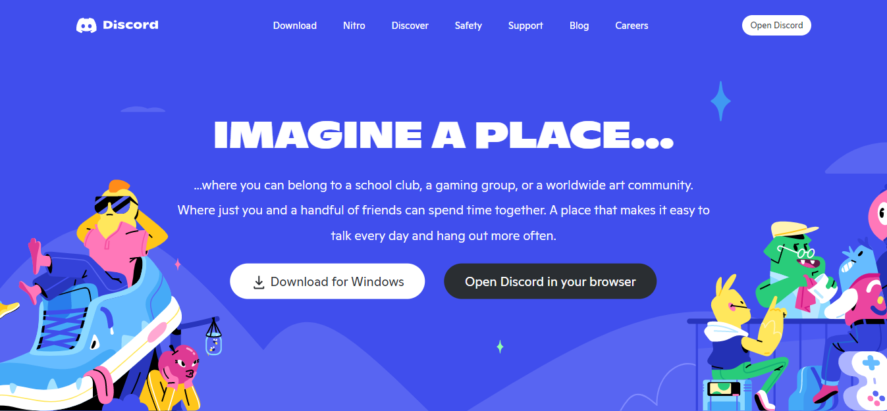
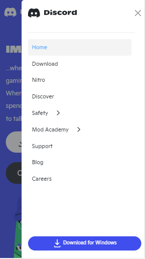

# Discord Clone

Mini Project 1 - [KodeGo Bootcamp](https://kodego.ph/?utm_source=google&utm_medium=ppc&utm_term&utm_campaign&hsa_acc=2048530460&hsa_cam=18127010636&hsa_grp&hsa_ad&hsa_src=x&hsa_tgt&hsa_kw&hsa_mt&hsa_net=adwords&hsa_ver=3&gclid=CjwKCAiAleOeBhBdEiwAfgmXf_rTsfB9L-c2DUxE2dv0bwdZP4Gcb8_T252WK1t61HlXqKA0keTQYRoC8H4QAvD_BwE)

## Description

A simple clone webpage of [Discord Landing Page](https://discord.com/)

## Technologies Used

-   HTML
-   CSS
-   Bootstrap 5
-   Sass
-   NPM

## Live Demo

[Visit Live Demo](https://discord-196.pages.dev/)

## Preview

